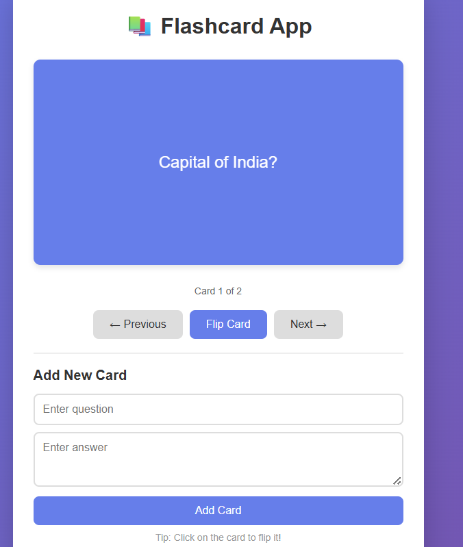

# Flash Card App 📚

A simple and interactive **Flash Card App** to help users learn and memorize information efficiently.  

---

## Features 

- **Create Flashcards:** Add new cards with questions and answers.   
- **Review Mode:** Flip cards to test your memory.  
- **Responsive UI:** Works on desktop and mobile.

## Tools Used

- HTML, CSS, JavaScript

---

## Preview

